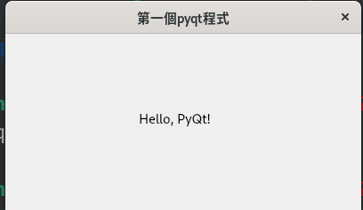

# 基本的視窗建立

## 最少的程式最簡的視窗
如果不用class或許可以更精簡，但是還是希望可以用到class。
只能說學會了之後感覺就很好用。
```py 
class MyWindow(QMainWindow):
    def __init__(self):
        super().__init__()

if __name__ == "__main__":
    app = QApplication(sys.argv)
    window = MyWindow()
    window.show()
    sys.exit(app.exec_())
```

## 標籤的使用方法
標籤最基本的功能就是提示使用者讓使用者可以好好的抄做。
### step1
引入函數庫

```py
import sys
from PyQt5.QtWidgets import QApplication, QMainWindow, QLabel
```
上面的QLabel就是標籤的物件，要使用前要先加入。
之後就可以使用了

### step2
我們要使用前都要計的建立一個變數來代表標籤，與設定顯示的資料，再來是他的位置
```py
class MyWindow(QMainWindow):
    def __init__(self):
      ...
      label = QLabel("Hello, PyQt!", self)
      label.move(150, 80)
      ...
```

### 結果

