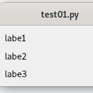
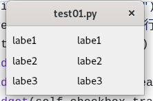

# 排版練習
 
-  基本的元件建立
-  水平與鉛直排列
-  一單元把東西放在def或是class來使用

## 結果
可以參考，先練垂直或是水平，之後再把兩個合在一起



## 基本的使用概念
使用排版最基本的東西當然就是要有東西給你排，你所抄做的的東西可以是按鈕或是標籤等物件，你也可以將這些東西包入水平或是垂直排版內之後在一組一組的處理。

你也可以把界面分成幾個QWidget

### QWidget 的使用
這個是gpt的說法:
QWidget 是 PyQt 與 Qt 庫中嘅一個重要類別，用嚟製造GUI應用程式嘅基本用戶界面元素。QWidget 係 Qt 中所有可視元素嘅基類，包括視窗、對話框、按鈕、文本框等等。

透過繼承 QWidget 類別，你可以製作自訂嘅GUI元素，同埋可以使用 QWidget 嘅方法嚟管理佢哋嘅外觀同行為。QWidget 有以下一啲重要嘅屬性同方法：

1. QWidget(parent=None): 建構函數，用嚟創建 QWidget 對象。你可以指定父視窗來建立GUI嘅階層結構。
1. setGeometry(x, y, width, height): 設置 QWidget 嘅位置同大小。
1. setWindowTitle(title): 設置 QWidget 嘅標題。
1. show(): 顯示 QWidget。
1. hide(): 隱藏 QWidget。
1. close(): 關閉 QWidget。
1. setStyleSheet(styleSheet): 設置 QWidget 嘅樣式表，用嚟自訂外觀。
1. 透過信號同槽機制嚟處理用戶互動同事件。

### QVBoxLayout, QHBoxLayout

QVBoxLayout（垂直布局）和QHBoxLayout（水平布局）是 PyQt 中用于管理和排列 GUI 控件的布局管理器。这些布局管理器允许您以一种灵活的方式将控件放置在窗口中，以确保它们根据窗口大小和屏幕分辨率进行适当的排列。

这里是如何使用它们的一些基本示例：

| 方法                        | 描述                               |
| -------------------------- | ---------------------------------- |
| addWidget(widget)        | 添加一个控制项到布局。            |
| addLayout(layout)        | 添加一个布局到当前布局。         |
| insertWidget(index, widget) | 在指定位置插入一个控制项。      |
| insertLayout(index, layout) | 在指定位置插入一个布局。        |
| removeWidget(widget)     | 从布局中移除一个控制项。          |
| removeItem(item)         | 从布局中移除一个项，可以是控制项或布局。 |
## class 的用法

### step1 
建立class類別並讓它繼承QWidget
```py
class GenderSelection(QWidget):
    def __init__(self):
```
### step2
開始建立元件
```py
        hbox_gender = QHBoxLayout()
        label_gender = QLabel("性别:")
        self.radio_male = QRadioButton("男")
        self.radio_female = QRadioButton("女")
```

### step3
排版
```py
        hbox_gender.addWidget(label_gender)
        hbox_gender.addWidget(self.radio_male)
        hbox_gender.addWidget(self.radio_female)
        self.setLayout(hbox_gender)
```

### step4
class 物件建立完成後就可以在main的部份使用。

```py
        # 添加各个部分的小部件
        name_input = NameInput()
        gender_selection = GenderSelection()
        hobbies_selection = HobbiesSelection()
        submit_button = SubmitButton()

        # 将各个部分的小部件添加到垂直布局中
        vbox.addWidget(name_input)
        vbox.addWidget(gender_selection)
        vbox.addWidget(hobbies_selection)
        vbox.addWidget(submit_button)
```
