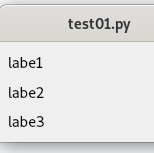
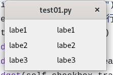

# 排版練習
 
-  基本的元件建立
-  水平與鉛直排列
-  一單元把東西放在def或是class來使用

## 結果
可以參考，先練垂直或是水平，之後再把兩個合在一起



## class 的用法

### step1 
建立class類別並讓它繼承QWidget
```py
class GenderSelection(QWidget):
    def __init__(self):
```
### step2
開始建立元件
```py
        hbox_gender = QHBoxLayout()
        label_gender = QLabel("性别:")
        self.radio_male = QRadioButton("男")
        self.radio_female = QRadioButton("女")
```

### step3
排版
```py
        hbox_gender.addWidget(label_gender)
        hbox_gender.addWidget(self.radio_male)
        hbox_gender.addWidget(self.radio_female)
        self.setLayout(hbox_gender)
```

### step4
class 物件建立完成後就可以在main的部份使用。

```py
        # 添加各个部分的小部件
        name_input = NameInput()
        gender_selection = GenderSelection()
        hobbies_selection = HobbiesSelection()
        submit_button = SubmitButton()

        # 将各个部分的小部件添加到垂直布局中
        vbox.addWidget(name_input)
        vbox.addWidget(gender_selection)
        vbox.addWidget(hobbies_selection)
        vbox.addWidget(submit_button)
```
